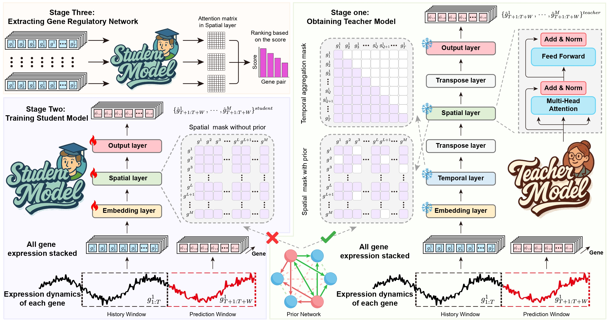
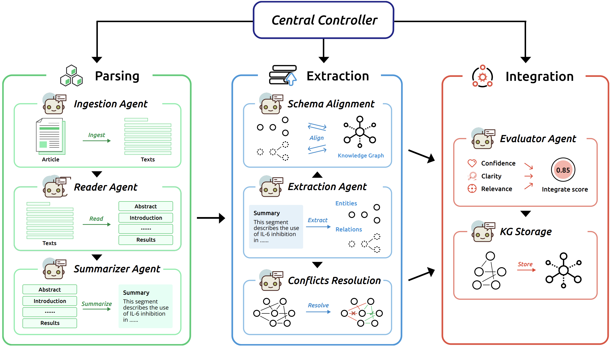
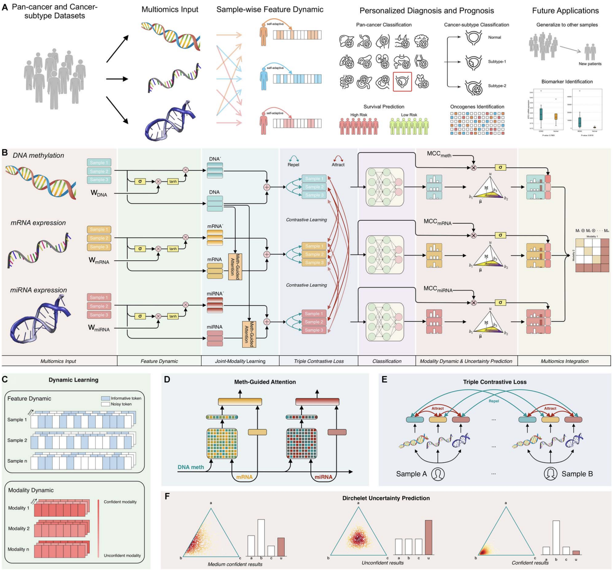
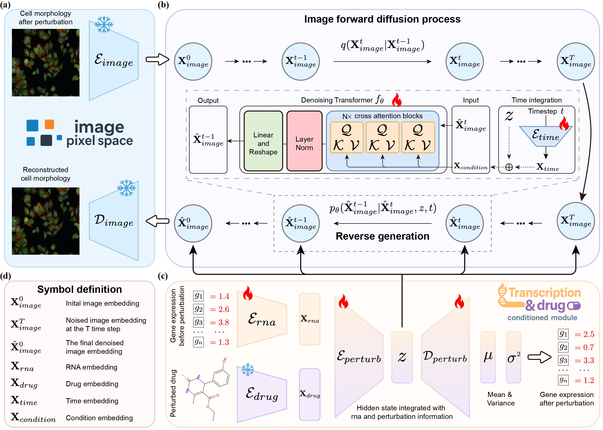
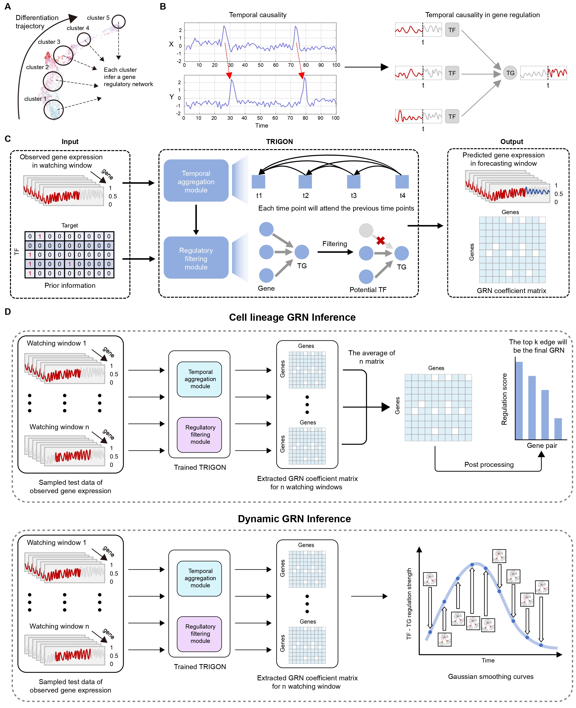








😎 Hi, I am **Rui Peng**, currently a third-year Ph.D. candidate at the **Academy for Advanced Interdisciplinary Studies (AAIS), Peking University**, where I am advised by [**Prof. Kang Zhang**](https://scholar.google.com/citations?user=cdzVY_QAAAAJ&hl=zh-CN). Prior to my doctoral studies, I received my B.S. degree from **Sichuan University** in 2023.

My research lies at the intersection of artificial intelligence and biomedicine, with a primary focus on the construction of **Virtual Cells** and the application of **Multi-modal Large Language Models** in healthcare. I aim to leverage computational methods to decode complex biological systems and accelerate drug discovery.

# 🔬 Research Interests

- **Generative Modeling for Virtual Cells**
    * Developing advanced **diffusion models** to simulate cellular responses to external perturbations.
    * Bridging the gap between molecular alterations (e.g., **gene expression** profiles) and phenotypic variations (e.g., **cell morphology**) to predict drug responses and cellular behavior.

- **Inference of Gene Regulatory Networks (GRNs)**
    * Utilizing **Graph Neural Networks (GNNs)** to reconstruct dynamic gene regulatory processes during development and disease progression.
    * Identifying critical **transcription factors** and regulatory hubs to elucidate the molecular mechanisms underlying pathogenesis.

- **Biomedical Multi-modal LLMs & Autonomous Agents**
    * Constructing multi-modal Large Language Models that integrate clinical text (e.g., **Electronic Health Records/EHR**) with medical imaging (e.g., **MRI, CT**).
    * Designing **autonomous agents** capable of automating complex clinical workflows and assisting in diagnostic reasoning.

- **Large-scale Longitudinal Cohort Analysis**
    * Mining data from large-scale longitudinal population cohorts to investigate proteomic signatures associated with **aging** and chronic diseases.
    * Facilitating **drug discovery** by identifying novel biomarkers and validating potential therapeutic targets.

# 📖 Education

- [2023.09 – Present] Ph.D. in Biology, Peking University (PKU)
- [2018.09 – 2023.06] B.S. in Computer Science, Sichuan University (SCU)  

# 🔥 News
- 🎉 [2025.11.23] We have published our preprint "TRIDENT: A Trimodal Cascade Generative Framework for Drug and
RNA-Conditioned Cellular Morphology Synthesis"! Click [here](https://arxiv.org/pdf/2511.18287v1) to see the paper.
- 🎉 [2025.11.23] I am happy to be invited as a Program Committee in CVPR 2026!
- 🎉 [2025.9.18] Two paper accepted to NeurIPS 2025! **KARMA is selected as Spotlight**!
- 🎉 [2025.9.3] I am happy to be invited as a Program Committee in ICLR 2026!
- 🎉 [2025.9.1] We have published our preprint "CellProphet: Dissecting Virtual Cell Differentiation through AI-Powered Dynamic Gene Regulatory Network Inference"! Click [here](https://www.biorxiv.org/content/10.1101/2025.02.05.636766v2.full.pdf) to see the paper.
- 🎉 [2025.4.13] I am happy to be invited as a Program Committee in NeurIPS 2025!

# 📝 Publications

NeurIPS 2025

**KINDLE: Knowledge-Guided Distillation for Prior-Free Gene Regulatory Network Inference**

**Rui Peng**, Yuchen Lu, Qichen Sun, <a href="https://yuxinglu613.github.io/" style="text-decoration: none;">Yuxing Lu</a>, Chi Zhang, Ziru Liu, Jinzhuo Wang\*

Advances in Neural Information Processing Systems (**NeurIPS**) 2025

[\[Paper\]](https://arxiv.org/pdf/2505.09664)

NeurIPS 2025 Spotlight

**KARMA: Leveraging Multi-Agent LLMs for Automated Knowledge Graph Enrichment**

<a href="https://yuxinglu613.github.io/" style="text-decoration: none;">Yuxing Lu</a>, Wei Wu, <a href="https://scholar.google.com/citations?user=Ko8zceoAAAAJ&hl=zh-CN&oi=ao" style="text-decoration: none;">Xukai Zhao</a>, **Rui Peng**, Jinzhuo Wang\*

Advances in Neural Information Processing Systems (**NeurIPS**) 2025 **Spotlight**

[\[Paper\]](https://openreview.net/pdf?id=k0wyi4cOGy)

BIB (SCI Q1)

**Multiomics dynamic learning enables personalized diagnosis and prognosis for pancancer and cancer subtypes**

<a href="https://yuxinglu613.github.io/" style="text-decoration: none;">Yuxing Lu</a>, **Rui Peng**, Lingkai Dong, Kun Xia, Renjie Wu, Shuai Xu, Jinzhuo Wang\*

Briefings in Bioinformatics (**BIB**) 2023

[\[Paper\]](https://academic.oup.com/bib/article/24/6/bbad378/7330495?login=false)

# 📝 Preprints

Preprint

**TRIDENT: A Trimodal Cascade Generative Framework for Drug and RNA-Conditioned Cellular Morphology Synthesis**

**Rui Peng**, Ziru Liu, Lingyuan Ye, <a href="https://yuxinglu613.github.io/" style="text-decoration: none;">Yuxing Lu</a>, <a href="https://scholar.google.com/citations?user=K1LjZxcAAAAJ&hl=en" style="text-decoration: none;">Boxin Shi</a>\*, Jinzhuo Wang\*

Preprint 2025

[\[Paper\]](https://arxiv.org/pdf/2511.18287v1)

Preprint

**CellProphet: Dissecting Virtual Cell Differentiation through AI-Powered Dynamic Gene Regulatory Network Inference**

**Rui Peng**, Yuanxu Gao, Yihan Chen, Jinzhuo Wang\*

Preprint 2025

[\[Paper\]](https://www.biorxiv.org/content/10.1101/2025.02.05.636766v2.full.pdf)

# 🎖 Honors and Awards
- [2021] **National Scholarship**
- [2019] Tsang Hin-chi Scholarship
- [2019] **National Encouragement Scholarship**

# 📚 Academic Services
- Serving as a reviewer of NeurIPS 2025, ICLR (2025, 2026), CVPR 2026
